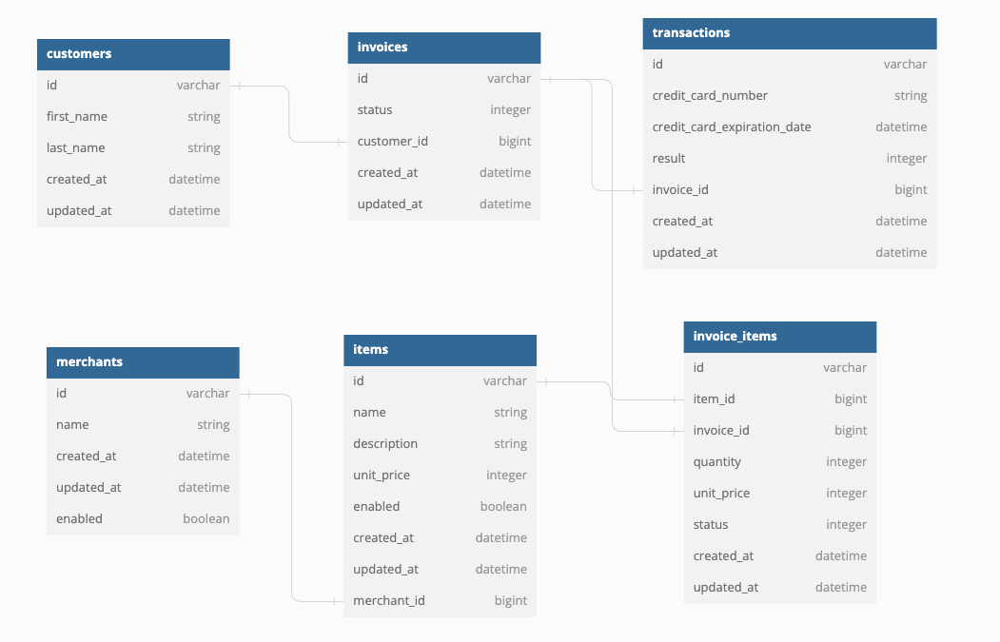

# Little Esty Shop 
 
## [Take me to the site!](https://afternoon-wave-94167.herokuapp.com/admin)

### "Little Esty Shop" is a group project that required us to build a fictitious e-commerce platform where merchants and admins can manage inventory and fulfill customer invoices.

##  ⚫ [Astrid Hecht](https://github.com/Astrid-Hecht) ⚫ [A.J. Krumholz](https://github.com/ajkrumholz) ⚫ [Alaina Kneiling](https://github.com/Alaina-Noel) ⚫ [Jake Kim](https://github.com/LlamaBack) ⚫

## How to fork & clone & see the code:
|How to see the code on your local machine |
|---|
|Fork this repository|
|Clone your fork|
|From the command line:  |
| run `bundle` |
| run `rails db:{drop,create,migrate,seed}` |
| run `rails csv_load:all`  |
| run `rails s`|
|This project requires Ruby 2.7.4. |
|---|

